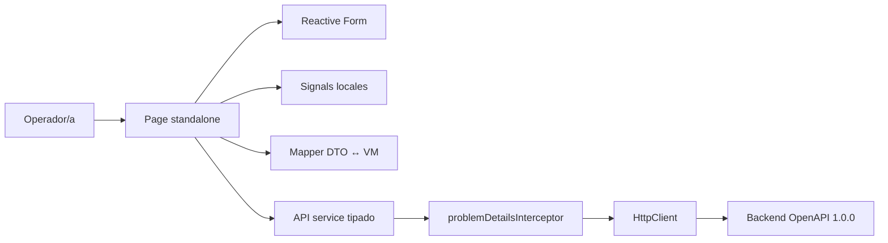
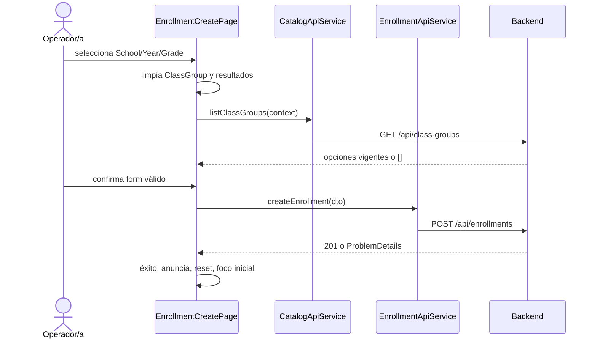

# Arquitectura frontend planificada

## Decisión

La aplicación será una SPA Angular standalone organizada por feature. Cada page contiene el estado de su recorrido, delega HTTP a servicios tipados y extrae componentes presentacionales solo cuando separan una interacción o tabla compleja. El backend y su OpenAPI permanecen canónicos.

## Límites



| Límite | Responsabilidad | No hace |
| --- | --- | --- |
| `page` | coordina form, estado remoto, foco y copy | reglas canónicas ni acceso HTTP directo |
| componente presentacional | renderiza inputs, tabla, cards y eventos tipados | carga datos ni mantiene store global |
| mapper | valida forma crítica y adapta DTO a VM | recalcular reportes, deduplicar u ordenar |
| API service | paths/query/payload tipados por feature | mostrar mensajes o decidir foco |
| interceptor | transporte y `ProblemDetails` reconocible | ocultar `errors` ni traducir reglas |
| backend | identidad, integridad, atomicidad, historia y orden | estado visual del frontend |

## Rutas

| Route | Page | Prioridad |
| --- | --- | --- |
| `/enrollments` | `EnrollmentCreatePage` | P0 |
| `/student-search` | `EnrollmentSearchPage` | P0 |
| `/teacher-contracts` | `TeacherContractsPage` | P0 |
| `/reports` | `ReportsPage` | P1 bloqueado por puerta P0 |
| `/student-history` | `StudentHistoryPage` | P1; manual o `?selection=<opaque-token>` desde búsqueda |

Las rutas técnicas son inglesas; la navegación visible usa Matrículas, Consulta de estudiantes, Contratos docentes y Reportes por decisión contextual documentada.

La búsqueda conserva sólo filtros académicos no sensibles en query params. Para
abrir historial, un servicio root registra temporalmente la identidad en memoria
y navega con un UUID opaco `selection`; no usa path/query de identidad, history
state ni Web Storage. El token expira y no constituye autorización.

El shell aplica una sola política tras cada `NavigationEnd`: resuelve el título
de ruta, actualiza `document.title`, enfoca el `h1` una vez y anuncia el mismo
texto en una región polite. Los estados remotos no reutilizan esa política ni
mueven foco automáticamente.

## Estructura futura

```text
src/app/
├── app.config.ts
├── app.routes.ts
├── core/
│   ├── api/
│   │   ├── api-base-url.token.ts
│   │   ├── api-problem.ts
│   │   ├── problem-details.interceptor.ts
│   │   └── problem-details.dto.ts
│   └── catalogs/
│       ├── catalog-api.service.ts
│       └── catalog.dto.ts
├── layout/
│   └── app-shell.component.ts
└── features/
    ├── enrollments/
    │   ├── data-access/enrollment-api.service.ts
    │   ├── models/
    │   ├── enrollment-create/
    │   └── enrollment-search/
    ├── teacher-contracts/
    │   ├── data-access/teacher-contract-api.service.ts
    │   ├── models/
    │   └── teacher-contracts-page.component.ts
    ├── reports/
    │   ├── data-access/report-api.service.ts
    │   └── reports-page.component.ts
    └── student-history/
        └── student-history-page.component.ts
```

No se crea `SharedModule`. Utilidades compartidas deben tener dos consumidores reales y una responsabilidad pequeña.

## Flujos P0

### Matrícula dependiente



Los cambios de contexto se canalizan con `switchMap`. Escuela limpia Año, Grado y Grupo; Año limpia Grado y Grupo; Grado limpia Grupo. Antes de cada request se limpian valor/opciones descendientes. Años y grados ya cargados pueden reutilizarse en memoria al habilitar el control siguiente. La respuesta de grupos solo se aplica si su `requestKey` coincide con `schoolId|academicYearId|gradeId`; así una respuesta tardía no revive datos obsoletos.

### Consulta y distinción de vacíos

Al buscar, FE-S02 ejecuta `listClassGroups` con Escuela, Grado y Año. Cualquier
combinación de referencias existentes es consultable. Si devuelve `200 []`,
presenta `noGroups` y omite una consulta de matrículas sin valor. Si existen
grupos, ejecuta `listEnrollments`: `200 []` significa `noResults`. No existe 422
por combinación académica incompatible en GET. Un cambio de filtro cancela la
cadena vigente y vuelve el resultado a `idle`.

### Contratos atómicos

El form genera un único `CreateTeacherContractsRequestDto` con todos los `schoolIds`. Durante el POST se deshabilita la confirmación. En 201 se reemplaza/recarga la tabla completa por `listTeacherContracts`; ante error no se incorpora ninguna fila optimista y se conserva el form para corrección.

## Estado

Cada page usa Signals para `RemoteState`, catálogos y mensajes. `School`,
`Grade`, `AcademicYear`, `Teacher` y la lista contractual modelan
loading/error/empty/success de forma exclusiva y exponen retry. Reactive Forms
es la fuente de verdad de inputs. RxJS se limita a HTTP, cancelación y
composición. No existe estado transversal que justifique NgRx; los catálogos
pueden cachearse durante la vida del servicio y se invalidan si el backend
rechaza una selección obsoleta.

Al abandonar una ruta se descarta su estado. No se usa `localStorage`, `sessionStorage` ni cache persistente.

## API y mapeo

- DTO de request/response separados de form y view models.
- Strings ISO de fecha se mantienen sin zona horaria hasta presentación.
- La query se construye con `HttpParams`; opcionales ausentes no se envían como `null`, vacío ni `undefined` textual.
- No se reordena ninguna respuesta; el orden determinista pertenece al backend.
- Los mappers validan arrays, campos discriminantes y enums usados por la vista. Una forma incompatible produce estado `invalidResponse`.
- Cada uno de los 13 métodos runtime se mapea explícitamente a su `operationId`.
- `listSubjects` y `listTeachersBySchool` se verifican dentro de las 15
  operaciones del bundle, pero no generan método frontend ni llamada artificial
  mientras carezcan de consumidor UI.
- `CreateEnrollmentResponseDto` declara de forma independiente todos sus campos
  y añade `studentReused`; no extiende ni reutiliza `EnrollmentListItemDto`, que
  no lo contiene. Reportes conservan propiedades fijas y contratos conservan
  `evaluatedAt`, omitidos y nullability canónicos.

## Errores

`problemDetailsInterceptor` es funcional (`HttpInterceptorFn`). Si el body coincide con `ProblemDetails`, conserva todos sus campos. Si hay desconexión o una forma inesperada, produce un `ApiProblem` de transporte seguro. La page:

1. aplica claves conocidas de `errors` a controles;
2. mantiene claves desconocidas en el resumen;
3. enfoca el primer campo inválido después del submit;
4. anuncia el resumen con `role="alert"`;
5. conserva datos corregibles y permite reintento.

Un 404 que evidencia catálogo obsoleto invalida la selección afectada y ofrece
recarga. Empty sigue reservado para una colección válida sin elementos.

## Responsive

Las listas con tabla y tarjetas comparten un único view model y orden. En cada
breakpoint, CSS `display:none` o render condicional elimina por completo la
representación inactiva del árbol accesible y del tab order. La validación a 320
CSS px y 200 % de zoom confirma que no existen acciones o contenidos duplicados.

## Configuración y seguridad

`API_BASE_URL` se configura desde `environment.apiBaseUrl`; no incluye secretos. El backend habilita CORS para el origen local previsto. No se agregan tokens, cookies, credenciales ni interceptor de autenticación. El frontend no muestra `instance`, detalles internos desconocidos ni extensiones no aprobadas de `ProblemDetails`.

El baseline OpenAPI autorizado es el commit backend
`1223630ab99bf1bfaa4f5919fccf5ff539379c8e`, con checksum
`802c13b91bf5c6425d24c540b6841a2abe134e084ea310fc2b7041e32c24a81a`.
La verificación acepta únicamente ese commit o un sucesor aprobado
explícitamente y rechaza archivos fuera del seguimiento de Git, un directorio
contractual con cambios o cualquier diferencia de checksum.

## Decisiones descartadas

| Alternativa | Motivo |
| --- | --- |
| NgRx/store global | no hay estado transversal ni persistente |
| cliente OpenAPI generado | tooling y artefactos desproporcionados para 15 operaciones/una jornada |
| facade por feature | solo envolvería un servicio y Signals locales |
| capa repository frontend | duplicaría API services sin abstracción útil |
| notificación global para todo error | ocultaría errores de campo y control de foco |
| orden/cálculo cliente | crearía una segunda fuente de verdad |

## Entrega y rollback

La implementación futura se dividirá en unidades revisables de hasta 400 líneas: base/API, matrícula, búsqueda, contratos y luego cada bloque P1. Cada unidad incluye sus pruebas y puede revertirse sin migración de datos frontend. No se requieren feature flags: la navegación final incluye Reportes, pero su ruta se incorpora a la entrega solo después de aprobar P0.
