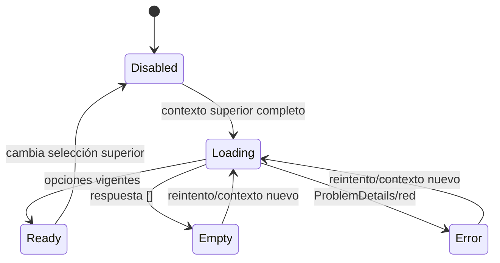

# Modelo de datos frontend

## Alcance y fuente

Este documento define modelos de transporte, formulario, vista y estado. No modela tablas ni entidades persistentes: esa responsabilidad pertenece al backend. Los campos HTTP se toman del [OpenAPI canónico](../../../inovait-backend/specs/001-school-enrollment-management/contracts/openapi.yaml); aquí se documentan límites y mapeos, no un contrato alternativo.

Las fechas viajan como `ISODateString` (`YYYY-MM-DD`) y no como `Date`, para evitar conversiones de zona horaria. Los identificadores son `number` positivos. Los DTO mantienen camelCase.

## DTO de API

### Catálogos

| DTO | Campos canónicos |
| --- | --- |
| `SchoolSummaryDto` | `id`, `name`, `sector: 'Public' | 'Private'` |
| `GradeSummaryDto` | `id`, `name`, `sortOrder` |
| `AcademicYearSummaryDto` | `id`, `name`, `startDate`, `endDate`, `isCurrent` |
| `ClassGroupSummaryDto` | `id`, `code`, `schoolId`, `academicYearId`, `gradeId` |
| `TeacherSummaryDto` | `id`, `documentType`, `documentNumber`, `firstNames`, `lastNames` |
| `SubjectSummaryDto` | `id`, `code`, `name` |
| `SchoolTeacherSummaryDto` | `teacher`, `contractId`, `persistedStatus`, `effectiveStatus`, `evaluatedAt`, `startDate`, `endDate: ISODateString | null` |

### Matrículas e historia

| DTO | Campos canónicos |
| --- | --- |
| `StudentIdentityInputDto` | `documentType`, `documentNumber`, `firstNames`, `lastNames`, `birthDate` |
| `CreateEnrollmentRequestDto` | `student`, `schoolId`, `academicYearId`, `gradeId`, `classGroupId` |
| `EnrollmentListItemDto` | `enrollmentId`, `studentId`, identidad, `age`, `school`, `academicYear`, `grade`, `classGroup`; nunca contiene `studentReused` |
| `CreateEnrollmentResponseDto` | schema independiente con `enrollmentId`, `studentId`, `studentReused`, identidad completa, `age`, `school`, `academicYear`, `grade`, `classGroup`; no extiende, intersecta ni reutiliza `EnrollmentListItemDto` |
| `HistoryTeachingAssignmentDto` | `assignmentId`, `teacher`, `subject`, `weekdays: number[]` |
| `EnrollmentHistoryItemDto` | `enrollmentId`, `academicYear`, `school`, `grade`, `classGroup`, `teachingAssignments` |
| `StudentHistoryResponseDto` | identidad del estudiante y `enrollments` |

### Contratos docentes

| DTO | Campos canónicos |
| --- | --- |
| `CreateTeacherContractsRequestDto` | `schoolIds`, `startDate`, `endDate?: ISODateString | null` |
| `TeacherContractResponseDto` | `id`, `teacherId`, `school`, `startDate`, `endDate: ISODateString | null`, `persistedStatus`, `effectiveStatus`, `evaluatedAt` |

`PersistedContractStatus` admite `Confirmed | Cancelled`. `EffectiveContractStatus` admite `Upcoming | Effective | Expired | Cancelled`. Nunca se fusionan en un único estado de vista.

### Reportes

| DTO | Campos canónicos |
| --- | --- |
| `Age3To7Dto` | `minimumAge: 3`, `maximumAge: 7`, `count` |
| `Age8To12Dto` | `minimumAge: 8`, `maximumAge: 12`, `count` |
| `AgeOver12Dto` | `minimumAge: 13`, `maximumAge: null`, `count` |
| `AgeDistributionResponseDto` | `academicYearId`, `schoolId?: number | null`, `gradeId?: number | null`, `asOfDate`, `age3To7: Age3To7Dto`, `age8To12: Age8To12Dto`, `ageOver12: AgeOver12Dto` |
| `TeacherCountsBySectorResponseDto` | `periodStart`, `periodEnd`, `publicDistinctTeacherCount`, `privateDistinctTeacherCount` |
| `TopSchoolResponseDto` | `school`, `academicYearId`, `enrollmentCount` |

### Errores

```typescript
interface ProblemDetailsDto {
  type: string;
  title: string;
  status: number;
  code: string;
  detail?: string | null;
  instance?: string | null;
  errors?: Record<string, string[]>;
  [extension: string]: unknown;
}
```

`ApiProblem` conserva esos campos y añade solo `kind: 'problem' | 'network' | 'invalidResponse'`. No inventa códigos de negocio. `FieldErrorMap` traduce claves conocidas del payload (`student.birthDate`, `schoolId`, etc.) a rutas de controles; claves desconocidas permanecen en el resumen general. Los fixtures cubren `detail`/`instance` omitidos y explícitamente `null`, además de `errors` omitido.

## Modelos de formulario

| Modelo | Controles | Reglas locales evidentes |
| --- | --- | --- |
| `EnrollmentFormModel` | identidad, `schoolId`, `academicYearId`, `gradeId`, `classGroupId` | requeridos, longitudes del contrato, fecha no futura, IDs seleccionados |
| `EnrollmentSearchFormModel` | `schoolId`, `gradeId`, `academicYearId`, `asOfDate?` | tres filtros obligatorios; fecha ISO válida |
| `TeacherContractFormModel` | `teacherId`, `schoolIds`, `startDate`, `endDate?` | docente y al menos una escuela; IDs únicos; fin ≥ inicio |
| `AgeReportFilterModel` | `academicYearId`, `schoolId?`, `gradeId?`, `asOfDate?` | año obligatorio; filtros opcionales acumulativos |
| `SectorReportFilterModel` | `periodStart?`, `periodEnd?` | ambos ausentes o ambos presentes; fin ≥ inicio |
| `TopSchoolsFilterModel` | `academicYearId` | obligatorio desde catálogo |
| `StudentHistoryFilterModel` | `documentType`, `documentNumber` | requeridos y longitudes canónicas |

Los forms usan `FormControl<T | null>` explícitos. Un form válido no prueba reglas de negocio: el backend puede responder 404, 409 o 422 y siempre prevalece.

## Modelos de vista

| View model | Transformación permitida |
| --- | --- |
| `CatalogOptionVm` | `value` y label en español; conserva DTO fuente para sector/año actual |
| `EnrollmentRowVm` | documento formateado, nombre completo, edad y labels de contexto; conserva IDs |
| `TeacherContractRowVm` | escuela/sector, rango visible, `persistedStatusLabel`, `effectiveStatusLabel`, `evaluatedAt` |
| `AgeReportVm` | tarjetas de valores exactos y fecha de referencia; sin recalcular conteos |
| `SectorReportVm` | tarjetas Public/Private y período devuelto |
| `TopSchoolRowVm` | escuela, sector y conteo; conserva todos los empates recibidos |
| `StudentHistoryVm` | cabecera de identidad, años y asignaciones con docentes, materias y días |

La UI traduce enums solo al presentar: `Public → Pública`, `Private → Privada`, `Confirmed → Confirmado`, `Effective → Vigente`, etc. No renombra JSON ni vuelve a derivar `effectiveStatus`.

## Estado local

```typescript
type RemoteState<T> =
  | { status: 'idle' }
  | { status: 'loading'; requestKey: string }
  | { status: 'success'; data: T }
  | { status: 'empty'; reason: 'noResults' | 'noGroups' | 'noOptions' | 'noContracts' }
  | { status: 'error'; problem: ApiProblem };
```

Cada page mantiene su `RemoteState` mediante Signal. Los catálogos de
`School`, `Grade`, `AcademicYear` y `Teacher`, y la lista de contratos, usan el
mismo conjunto exclusivo loading/error/empty/success y conservan una acción de
reintento. Los formularios mantienen su estado con Reactive Forms. No se
persisten filtros ni respuestas en storage.

### Estado de selectores académicos



En matrícula, cambiar `schoolId` limpia `academicYearId`, `gradeId` y `classGroupId`; cambiar `academicYearId` limpia `gradeId` y `classGroupId`; cambiar `gradeId` limpia `classGroupId`. También se limpian opciones/resultados descendientes antes de reactivar el siguiente control. Los catálogos globales de años y grados pueden reutilizarse en memoria, pero su control permanece deshabilitado hasta completar el superior. `switchMap` cancela la petición de grupos anterior y `requestKey` impide aplicar una respuesta que no corresponda al contexto vigente. Si el backend rechaza una referencia cargada previamente, el catálogo se marca obsoleto, se invalida la selección afectada y se ofrece recarga; nunca se trata como éxito vacío.

En búsqueda, toda combinación de School/Grade/AcademicYear existentes es válida.
`listClassGroups` puede comprobarla antes de `listEnrollments`: `200 []` produce
`reason: 'noGroups'`; con grupos, `listEnrollments` `200 []` produce
`reason: 'noResults'`. Ningún caso espera `422` por combinación incompatible.

## Mapeos y validación de frontera

1. El page transforma el form válido a request DTO sin normalizar reglas de identidad reservadas al backend.
2. Cada método runtime del API service declara su `operationId` canónico y construye path/query exactamente según él. Se implementan 13 métodos; `listSubjects` y `listTeachersBySchool` se comprueban en la prueba contractual sin método ni llamada runtime.
3. Un mapper valida campos discriminantes, arrays y enums necesarios; una forma imposible produce `invalidResponse`, no datos parciales.
4. El mapper crea view models de presentación sin alterar orden ni conteos.
5. Los errores pasan por el interceptor y luego por el `FieldErrorMap` del feature.

No se ordenan listas devueltas por la API: el orden canónico se presenta y se prueba. No se deduplican contratos, docentes, materias, empates ni asignaciones en el cliente.

## Fixtures de contrato mínimos

- `CreateTeacherContractsRequestDto` con `endDate` omitido y con `endDate: null`.
- `TeacherContractResponseDto` y `SchoolTeacherSummaryDto` con `endDate: null` y `evaluatedAt` requerido.
- `AgeDistributionResponseDto` con `schoolId`/`gradeId` omitidos y explícitamente `null`, y tres propiedades de rango fijas; `AgeOver12Dto.maximumAge` es siempre `null`.
- `ProblemDetailsDto` con opcionales omitidos y con `detail`/`instance: null`.
- `CreateEnrollmentResponseDto` independiente con `studentReused`; `EnrollmentListItemDto` separado y sin esa propiedad.

T009 crea solo fixtures P0 antes de sus tests. Después de la puerta T035, T036
crea fixtures P1 de reportes e historia antes de sus tests. Ninguno constituye un
mock de reglas de negocio.
